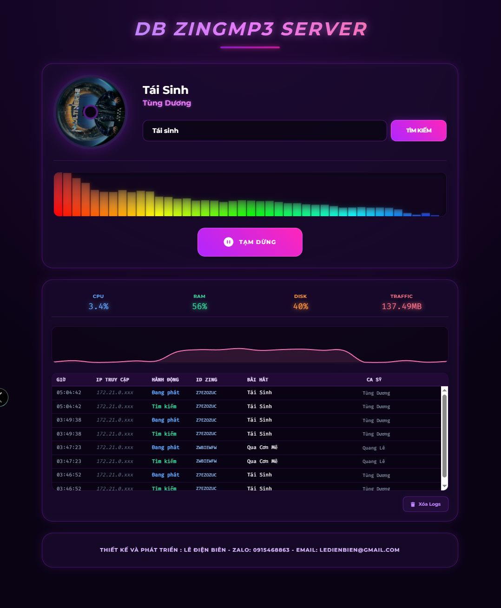

[](https://github.com/ledienbien-ai/DB-zingmp3-servermusic)

<h1 align="center">Máy chủ Âm nhạc DB Zing MP3 Xiaozhi </h1>

<p align="center">
Dự án này dựa trên lý thuyết và công nghệ trí tuệ cộng sinh người-máy để phát triển hệ thống phần mềm và phần cứng thiết bị đầu cuối thông minh<br/>Cung cấp dịch vụ backend cho dự án phần cứng thông minh mã nguồn mở
<a href="https://github.com/78/xiaozhi-esp32">xiaozhi-esp32</a> và <a href="https://github.com/TienHuyIoT/xiaozhi-esp32_vietnam">Xiaozhi Iot VN</a> <br/>
Được triển khai bằng Python, Script, Node.
</p>

<p align="center">
<a href="./README.md">Hướng dẫn triển khai</a>
· <a href="https://github.com/ledienbien-ai/DB-zingmp3-servermusic/issues">Báo cáo vấn đề</a>
· <a href="./README.md">Tài liệu triển khai</a>
· <a href="https://github.com/ledienbien-ai/DB-zingmp3-servermusic/releases">Nhật ký cập nhật</a>
</p>

<p align="center">
  <a href="./README.md"></a>
  <a href="https://github.com/ledienbien-ai/DB-zingmp3-servermusic/releases">
  <a href="https://github.com/ledienbien-ai/DB-zingmp3-servermusic/LICENSE">
    
  </a>
  <a href="https://github.com/ledienbien-ai/DB-zingmp3-servermusic">
    
  </a>
</p>

<p align="center">
Vibe Codding bởi Lê Điện Biên - <a href="https://zalo.me/0915468863" target="blank"> Zalo Me </a>- Email: ledienbien@gmail.com - Cộng đồng Xiaozhi IoT Vn
</p>
<p align="center"> DEMO: <a href="https://zing.ledienbien.edu.vn" target="blank" >https://zing.ledienbien.edu.vn</a>
</p>
---

## I.Người dùng phù hợp 👥

Dự án này cần được sử dụng cùng với thiết bị phần cứng ESP32. Nếu bạn đã mua phần cứng liên quan đến ESP32, đã thành công kết nối với dịch vụ backend do Cộng đồng Xiaozhi IoT Vn phát triển, và muốn xây dựng dịch vụ backend máy chủ âm nhạc lấy nguồn từ Zing Mp3 riêng của mình, thì dự án này rất phù hợp với bạn.

Đây là server giúp các bạn tạo link nhạc kết nối vào wifi config hoặc gắn cứng vào firmware thay server gốc để phát nhạc trong "esp32_music.cc"

---

## II.Cảnh báo ⚠️

1. Dự án này là phần mềm mã nguồn mở, phần mềm này không có quan hệ hợp tác thương mại với bất kỳ nhà cung cấp dịch vụ API bên thứ ba nào (bao gồm nhưng không giới hạn ở các nền tảng v.v.), và không đảm bảo chất lượng dịch vụ cũng như an toàn tài chính của họ.
Khuyến nghị người dùng ưu tiên lựa chọn nhà cung cấp dịch vụ có giấy phép kinh doanh liên quan và đọc kỹ thỏa thuận dịch vụ và chính sách bảo mật của họ. Phần mềm này không lưu trữ bất kỳ khóa tài khoản nào, không tham gia vào luồng tiền và không chịu rủi ro mất tiền nạp.

2. Chức năng của dự án này chưa hoàn thiện và chưa qua đánh giá bảo mật mạng, vui lòng không sử dụng trong môi trường sản xuất. Nếu bạn triển khai dự án này trong môi trường mạng công cộng để học tập, vui lòng thực hiện các biện pháp bảo vệ cần thiết.

---

## III.Tài liệu triển khai DB Zing MP3 Music Server trên máy chủ Armbian:

#### 🚩 Mô tả và khuyến nghị cấu hình
> [!Note]
> Dự án này yêu cầu cấu hình:
>
> 1. `Miễn phí hoàn toàn cho người mới`: Phù hợp với sử dụng nhu cầu cá nhân, tất cả các thành phần đều sử dụng phương án miễn phí, không cần thanh toán thêm.
>
> 2. `Cấu hình máy chủ`: Máy chủ Armbian có cấu hình tối thiểu Ram 1GB, bộ nhớ trống 2,5 GB - Cài sẵn Docker, cấu hình càng cao cho trải nghiệm tốt hơn.
>
## IV.Danh sách tính năng ✨
### Đã thực hiện ✅
| Giao diện phát nhạc trực tiếp trên trình duyệt PCC hoặc Mobile|
| Mã hoá json chạy trên Firrmware của thiết bị ESP32 Xiaozhi |
| Nguồn nhạc chính thống từ server Zing Mp3 - thường xuyên Update |
| CBảo mật IP thiết bị tránh bị lộ IP khi dùng chung nhiều thiết bị |
| Hoàn toàn miễn phí |
### Đang phát triển 🚩
| Giao diện phát nhạc theo danh sách Playlist|

### V.Các bước thực hiện 🚧

<b>***PP1*** Phương pháp cài từ Thẻ nhớ, USB:</b>
- Bước 1 : Truy cập <a href="https://github.com/ledienbien-ai/DB-zingmp3-servermusic"> DB-zingmp3-servermusic</a>. Chọn Code - Download zip - giải nén DB-zingmp3-servermusic - Copy vào thẻ nhớ, USB.
- Bước 2 : Cắm usb vào thiết bị Armbian . SSH vào Armbian và kiểm tra thư mục chứa dự án
```bash
df -h
```
Hoặc
```bash
lsblk
```
1. Tạo thư mục để gắn USB
Bạn cần tạo một thư mục trống đóng vai trò làm "cửa ngõ" để truy cập USB. Chạy lệnh sau:

```bash
sudo mkdir -p /mnt/usb
```
2. Mount (gắn) USB vào thư mục vừa tạo
Vì lsblk chỉ hiện sda mà không có phân vùng con (như sda1), dữ liệu của bạn có thể nằm trực tiếp trên toàn bộ ổ đĩa. Chạy lệnh:

```bash
sudo mount /dev/sda /mnt/usb
```
(Nếu hệ thống yêu cầu mật khẩu, hãy nhập mật khẩu của user armbian).

3. Kiểm tra dữ liệu và chạy Server
Nếu lệnh mount thành công và không báo lỗi gì, USB của bạn đã sẵn sàng.

Kiểm tra xem thư mục DB-zingmp3-servermusic đã xuất hiện chưa:

```bash
ls /mnt/usb
```
Di chuyển vào thư mục đó:

```bash
cd /mnt/usb/DB-zingmp3-servermusic
```
Khởi chạy Docker:

```bash
docker compose up -d
```
 *Note: Các bạn kiên nhẫn đợi dự án triển khai và cài các thư viện đi kèm và bật Container trong Docker: Quá trình nhanh hay chậm phụ thuộc phần cứng và tốc độ mạng của bạn. <br>
4. Tạo mạng xiaozhi-network để khởi chạy server:
```bash
docker network create xiaozhi-network
```
5. Kiểm tra và test thử Server:
Truy cập máy chủ theo đường dẫn:
```bash
http:/localhost:5001 
```
hoặc 
```bash
http://IP Armbian:5001
```
***PP2*** Phương pháp triển khai trực tiếp trong Docker:
1. Tạo thư mục và file cấu hình, các bạn hãy chạy các lệnh sau trên terminal để tạo một thư mục mới:

```bash
sudo mkdir -p /mnt/usb/DB-zingmp3-servermusic
```
```bash
cd /mnt/usb/DB-zingmp3-servermusic
```
2. Tạo file Dockerfile
Chạy 
```bash
sudo nano Dockerfile 
```
và dán nội dung sau:

```bash
# DIENBIEN MOD - Server nhạc Zing MP3 chạy trên Armbian
#=======================================================
FROM python:3.10
RUN apt-get update && apt-get install -y ffmpeg && rm -rf /var/lib/apt/lists/*
WORKDIR /app
COPY requirements.txt .
RUN pip install --upgrade pip
RUN pip install --no-cache-dir -r requirements.txt
COPY . .
CMD ["python", "app.py"]

# End - DIENBIEN MOD - Server nhạc Zing MP3 chạy trên Armbian
#============================================================
```

(Lưu lại bằng Ctrl+O -> Enter -> Ctrl+X)

3. Tạo file requirements.txt
Chạy 
```bash
sudo nano requirements.txt
```
 và dán:

```bash
# DIENBIEN MOD - Server nhạc Zing MP3 chạy trên Armbian
#=======================================================

Flask==3.0.0
flask-cors==4.0.0
psutil==5.9.6
requests

# End - DIENBIEN MOD - Server nhạc Zing MP3 chạy trên Armbian
#============================================================
```

4. Tạo file docker-compose.yml
Chạy 
```bash
sudo nano docker-compose.yml
```

 và dán cấu hình này (lưu ý cổng là 5001:5000 và kết nối cùng mạng xiaozhi-network):

```bash
# DIENBIEN MOD - Server nhạc Zing MP3 chạy trên Armbian
#=======================================================
services:
  zingmp3-server:
    build: .
    container_name: zingmp3-server
    restart: unless-stopped
    ports:
      - "5001:5000"
    networks:
      - xiaozhi-network
    volumes:
      - .:/app
    depends_on:
      - zing-api

  zing-api:
    image: node:18-alpine
    container_name: zing-api
    restart: unless-stopped
    working_dir: /app
    volumes:
      - .:/app
    command: sh -c "npm install zingmp3-api-full express && node zing-api.js"
    networks:
      - xiaozhi-network
    ports:
      - "5555:5555"

networks:
  xiaozhi-network:
    external: true
    
# End - DIENBIEN MOD - Server nhạc Zing MP3 chạy trên Armbian
#============================================================
```
5. Tạo file API Node.js vào thư mục dự án
Chạy 
```bash
sudo nano zing-api.js
```
Dán nội dung:

```bash
// DIENBIEN MOD - Server nhạc Zing MP3 chạy trên Armbian
//=======================================================
const { ZingMp3 } = require("zingmp3-api-full");
const express = require("express");
const app = express();
const PORT = 5555;

// API Tìm kiếm
app.get("/api/search", async (req, res) => {
    try {
        const q = req.query.q;
        console.log(`🔍 [API 5555] Đang tìm: ${q}`);
        const data = await ZingMp3.search(q);
        res.json(data);
    } catch (err) {
        res.status(500).json({ error: err.message });
    }
});

// API Lấy link nhạc
app.get("/api/song", async (req, res) => {
    try {
        const id = req.query.id;
        console.log(`🎵 [API 5555] Lấy link ID: ${id}`);
        const data = await ZingMp3.getSong(id);
        res.json(data);
    } catch (err) {
        res.status(500).json({ error: err.message });
    }
});

app.listen(PORT, () => {
    console.log(`✅ Zing API Backend đang chạy tại http://0.0.0.0:${PORT}`);
});
// End - DIENBIEN MOD - Server nhạc Zing MP3 chạy trên Armbian
//============================================================
```

6. Tạo file app.py (Mã nguồn chính): <br>
Chạy :
```bash
sudo nano app.py
```
và dán toàn bộ đoạn code dưới đây:

```bash
# DIENBIEN MOD - Server nhạc Zing MP3 chạy trên Armbian
#=======================================================
import logging
import time
import subprocess
import psutil
import urllib.parse
import requests
from flask import Flask, request, Response, jsonify
from flask_cors import CORS
from datetime import datetime

# Cấu hình Log
logging.basicConfig(level=logging.INFO, format='%(asctime)s - %(levelname)s - %(message)s')
logger = logging.getLogger(__name__)

app = Flask(__name__)
CORS(app)

audio_cache = {}
access_logs = []

# Backend URL 5555 để lấy thông tin bài hát:
BACKEND_URL = 'http://zing-api:5555'

def mask_ip(ip):
    try:
        parts = ip.split('.')
        if len(parts) == 4:
            return f"{parts[0]}.{parts[1]}.{parts[2]}.xxx"
        return "xxx.xxx.xxx.xxx"
    except: return ip

def add_log(ip, action, song_id="-", song="", artist="", type='info'):
    now = datetime.now().strftime("%H:%M:%S")
    masked_ip = mask_ip(ip)
    access_logs.insert(0, {
        "time": now, "ip": masked_ip, "action": action, 
        "song_id": song_id, "song": song, "artist": artist, "type": type
    })
    if len(access_logs) > 30: access_logs.pop()

@app.route('/api/sys_stats')
def sys_stats():
    return jsonify({
        "cpu": psutil.cpu_percent(),
        "ram": psutil.virtual_memory().percent,
        "disk": psutil.disk_usage('/').percent,
        "net_sent": round(psutil.net_io_counters().bytes_sent / (1024 * 1024), 2),
        "logs": access_logs
    })

@app.route('/api/clear_logs', methods=['POST'])
def clear_logs_api():
    access_logs.clear()
    return jsonify({"success": True})

@app.route('/stream_pcm')
def api_get_info_json():
    song = request.args.get('song', '')
    if not song: return jsonify({"error": "Missing query"}), 400
    
    # 1. Gọi backend 5555 để lấy thông tin bài hát:
    try:
        sRes = requests.get(f"{BACKEND_URL}/api/search?q={urllib.parse.quote(song)}", timeout=10).json()
        songs_data = sRes.get('data', {}).get('songs', [])
        if not songs_data:
            add_log(request.remote_addr, "LỖI TÌM", type="error")
            return jsonify({"error": "Không tìm thấy bài hát trên ZingMP3"}), 404
            
        song_info = songs_data[0]
        song_id = song_info.get('encodeId')
        title = song_info.get('title')
        artist = song_info.get('artistsNames', 'Unknown')
        thumb = song_info.get('thumbnailM') or song_info.get('thumbnail')
    except Exception as e:
        logger.error(f"Lỗi kết nối Backend 5555 Search: {e}")
        return jsonify({"error": "Lỗi kết nối API 5555"}), 500

    current_time = time.time()
    
    # 2. Gọi backend 5555 để lấy Link Audio Stream:
    if song_id not in audio_cache or (current_time - audio_cache[song_id]['timestamp'] > 1800):
        try:
            lRes = requests.get(f"{BACKEND_URL}/api/song?id={song_id}", timeout=10).json()
            data = lRes.get('data', {})
            
            real_url = data.get('128') or lRes.get('url')
            if not real_url:
                add_log(request.remote_addr, "LỖI VIP", song_id=song_id, song=title, artist=artist, type="error")
                return jsonify({"error": "Không lấy được link nhạc (Bài VIP hoặc lỗi Session)"}), 403
                
            real_url = real_url.replace('http:', 'https:')
            audio_cache[song_id] = {'url': real_url, 'timestamp': current_time, 'title': title, 'artist': artist}
        except Exception as e:
            logger.error(f"Lỗi lấy link Audio API 5555: {e}")
            return jsonify({"error": "Lỗi giải mã luồng nhạc"}), 500

    add_log(request.remote_addr, "Tìm kiếm", song_id=song_id, song=title, artist=artist, type="success")
    return jsonify({"success": True, "title": title, "artist": artist, "thumbnail": thumb, "audio_url": f"/stream_mp3?id={song_id}"})

@app.route('/stream_mp3')
def api_stream_audio():
    song_id = request.args.get('id')
    cached = audio_cache.get(song_id)
    if not cached: return "Expired", 404
    
    add_log(request.remote_addr, "Đang phát", song_id=song_id, song=cached['title'], artist=cached['artist'], type="info")
    
    # Cấu hình FFMPEG mô phỏng trình duyệt:
    ffmpeg_cmd = [
        'ffmpeg', '-reconnect', '1', '-reconnect_streamed', '1', 
        '-user_agent', 'Mozilla/5.0 (Windows NT 10.0; Win64; x64) AppleWebKit/537.36',
        '-headers', 'Referer: https://zingmp3.vn/\r\n',
        '-i', cached['url'], 
        '-ac', '2', '-ar', '44100', '-b:a', '128k', '-f', 'mp3', '-'
    ]
    
    def generate():
        process = subprocess.Popen(ffmpeg_cmd, stdout=subprocess.PIPE, stderr=subprocess.DEVNULL)
        try:
            while True:
                chunk = process.stdout.read(8192)
                if not chunk: break
                yield chunk
        finally: process.kill()
    return Response(generate(), mimetype='audio/mpeg', headers={'Access-Control-Allow-Origin': '*'})

@app.route('/')
def home():
    return """
<!DOCTYPE html>
<html lang="vi">
<head>
    <meta charset="UTF-8"><title>DB Music Server</title>
    <script src="https://cdn.tailwindcss.com"></script>
    <script src="https://cdn.jsdelivr.net/npm/chart.js"></script>
    <link href="https://cdnjs.cloudflare.com/ajax/libs/font-awesome/6.0.0/css/all.min.css" rel="stylesheet">
    <style>
        @import url('https://fonts.googleapis.com/css2?family=Fira+Code&family=Montserrat:wght@700&display=swap');
        :root { --neon-purple: #b026ff; --neon-pink: #ff26b9; --bg-dark: #090314; --card-bg: rgba(25, 10, 45, 0.7); }
        body { font-family: 'Montserrat', sans-serif; background: var(--bg-dark); background-image: radial-gradient(circle at 50% 0%, rgba(176, 38, 255, 0.15) 0%, transparent 50%); color: #e2e8f0; min-height: 100vh; }
        .rotating { animation: rotate 15s linear infinite; }
        @keyframes rotate { from { transform: rotate(0deg); } to { transform: rotate(360deg); } }
        .card-dark { background: var(--card-bg); border: 1px solid rgba(176, 38, 255, 0.3); border-radius: 1.5rem; backdrop-filter: blur(10px); box-shadow: 0 0 20px rgba(176, 38, 255, 0.15), inset 0 0 15px rgba(176, 38, 255, 0.05); }
        .stat-val { font-family: 'Fira Code', monospace; text-shadow: 0 0 10px currentColor; }
        .log-line { font-family: 'Fira Code', monospace; font-size: 11px; display: grid; grid-template-columns: 75px 110px 85px 100px 1.5fr 1fr; gap: 10px; padding: 6px 10px; border-bottom: 1px solid rgba(176, 38, 255, 0.2); align-items: center; }
        .header-title { font-size: 2.5rem; letter-spacing: 0.2rem; background: linear-gradient(to right, #c084fc, #e879f9, #f472b6); -webkit-background-clip: text; -webkit-text-fill-color: transparent; filter: drop-shadow(0 0 8px rgba(232, 121, 249, 0.5)); }
        .btn-neon { background: linear-gradient(45deg, var(--neon-purple), var(--neon-pink)); box-shadow: 0 0 15px rgba(176, 38, 255, 0.4); border: 1px solid rgba(255, 255, 255, 0.2); transition: all 0.3s ease; }
        .btn-neon:hover { box-shadow: 0 0 25px rgba(255, 38, 185, 0.6), 0 0 10px rgba(176, 38, 255, 0.8); transform: scale(1.05); }
        .input-neon { background: rgba(10, 5, 20, 0.8); border: 1px solid rgba(176, 38, 255, 0.4); transition: all 0.3s ease; color: #fff; }
        .input-neon:focus { outline: none; border-color: var(--neon-pink); box-shadow: 0 0 15px rgba(255, 38, 185, 0.4), inset 0 0 5px rgba(255, 38, 185, 0.2); }
        .disc-neon { border-color: #2d1b4e; box-shadow: 0 0 30px rgba(176, 38, 255, 0.3); }
    </style>
</head>
<body class="min-h-screen p-4 flex flex-col items-center gap-6">
    <div class="text-center mt-4 mb-2">
        <h1 class="header-title font-black uppercase italic">DB ZINGMP3 SERVER</h1>
        <div class="h-1 w-32 mx-auto rounded-full mt-2 opacity-70" style="background: linear-gradient(to right, #b026ff, #ff26b9); box-shadow: 0 0 10px #ff26b9;"></div>
    </div>
    
    <div class="card-dark p-6 w-full max-w-4xl flex flex-col gap-6">
        <div class="flex flex-col md:flex-row items-center gap-8 border-b border-purple-900/50 pb-6">
            <div id="discWrapper" class="disc-neon relative w-40 h-40 rounded-full border-[6px] overflow-hidden bg-black flex items-center justify-center shrink-0">
                <div id="songThumb" class="absolute inset-0 bg-cover bg-center opacity-70" style="background-image: url('https://images.unsplash.com/photo-1614613535308-eb5fbd3d2c17?w=300');"></div>
                <div class="w-8 h-8 rounded-full z-20 border-4 border-purple-900" style="background: #090314;"></div>
            </div>
            <div class="text-center md:text-left w-full overflow-hidden">
                <h2 id="title" class="text-2xl font-bold text-white truncate drop-shadow-md">Kết nối ZingMP3 thành công</h2>
                <p id="artist" class="text-fuchsia-400 font-semibold mb-6" style="text-shadow: 0 0 5px rgba(232, 121, 249, 0.5);">Mời nhập tên bài hát</p>
                <div class="flex gap-2">
                    <input type="text" id="songInput" onkeypress="if(event.key==='Enter')handleSearch()" placeholder="Nhập tên bài hát ZingMP3..." class="input-neon px-5 py-3 rounded-xl w-full text-sm placeholder-purple-300/50">
                    <button onclick="handleSearch()" class="btn-neon text-white px-8 rounded-xl font-bold uppercase text-xs tracking-tighter shrink-0">Tìm kiếm</button>
                </div>
            </div>
        </div>
        
        <canvas id="visualizerCanvas" class="w-full h-24 bg-black/30 rounded-xl border border-purple-900/30 shadow-[inset_0_0_10px_rgba(0,0,0,0.5)]"></canvas>
        
        <div class="flex justify-center">
            <button id="playBtn" onclick="handlePlay()" class="btn-neon text-white px-14 py-4 rounded-2xl font-bold flex items-center gap-3 uppercase text-xs tracking-widest shadow-lg">
                <i class="fas fa-play-circle text-2xl"></i> PHÁT NHẠC
            </button>
        </div>
    </div>

    <div class="card-dark p-5 w-full max-w-4xl flex flex-col gap-5">
        <div class="grid grid-cols-4 gap-4 text-center py-2 border-b border-purple-900/50">
            <div><p class="text-[10px] text-blue-400 font-bold uppercase tracking-wider">CPU</p><p id="cpu-v" class="stat-val text-lg text-blue-400">0%</p></div>
            <div><p class="text-[10px] text-emerald-400 font-bold uppercase tracking-wider">RAM</p><p id="ram-v" class="stat-val text-lg text-emerald-400">0%</p></div>
            <div><p class="text-[10px] text-orange-400 font-bold uppercase tracking-wider">DISK</p><p id="disk-v" class="stat-val text-lg text-orange-400">0%</p></div>
            <div><p class="text-[10px] text-rose-400 font-bold uppercase tracking-wider">TRAFFIC</p><p id="net-v" class="stat-val text-lg text-rose-400">0MB</p></div>
        </div>
        <div class="h-20 bg-black/40 rounded-xl overflow-hidden border border-purple-900/30"><canvas id="cpuChart"></canvas></div>
        
        <div class="flex flex-col gap-2">
            <div class="flex flex-col bg-black/50 rounded-xl overflow-hidden border border-purple-900/40">
                <div class="log-line font-bold bg-purple-900/30 text-[10px] text-purple-200 uppercase tracking-wider border-b border-purple-800/50">
                    <span>GIỜ</span><span>IP TRUY CẬP</span><span>HÀNH ĐỘNG</span><span>ID ZING</span><span>BÀI HÁT</span><span>CA SỸ</span>
                </div>
                <div id="logList" class="h-56 overflow-y-auto flex flex-col scrollbar-thin scrollbar-thumb-purple-600 scrollbar-track-transparent">
                    <div class="p-4 text-center text-purple-400/50 italic text-sm">Chờ dữ liệu...</div>
                </div>
            </div>
            <button onclick="clearLogs()" class="self-end text-purple-400 hover:text-pink-400 transition text-[10px] font-bold flex items-center gap-2 px-4 py-2 bg-purple-900/20 hover:bg-pink-900/30 rounded-lg mt-1 border border-purple-700/50 hover:border-pink-500/50 shadow-[0_0_10px_rgba(176,38,255,0.1)] hover:shadow-[0_0_10px_rgba(255,38,185,0.3)]">
                <i class="fas fa-trash"></i> Xóa Logs
            </button>
        </div>
    </div>

    <div class="card-dark p-4 w-full max-w-4xl flex flex-col gap-2 border border-red-900/30 bg-red-900/10 rounded-xl">
        <h3 class="text-[11px] font-bold text-red-400/80 uppercase tracking-widest text-center flex items-center justify-center gap-2">
            <i class="fas fa-exclamation-triangle"></i> Tuyên bố miễn trừ trách nhiệm
        </h3>
        <p class="text-[10px] text-gray-400/80 leading-relaxed text-justify px-2">
            Server sử dụng nguồn dữ liệu và bài hát từ Zing MP3. Mọi bản quyền tác phẩm âm nhạc, hình ảnh và thông tin liên quan hoàn toàn thuộc về Zing MP3 và các đơn vị chủ quản/tác giả. Nghiêm cấm sử dụng mã nguồn và hệ thống này cho mục đích thương mại hoặc kinh doanh dưới mọi hình thức khi chưa có sự cho phép của đơn vị chủ quản. Mã nguồn này được thiết kế với mục đích học tập, nghiên cứu cá nhân. Chủ sở hữu mã nguồn sẵn sàng gỡ bỏ mọi tác quyền và dừng hoạt động nếu có yêu cầu từ đơn vị sở hữu bản quyền, đồng thời tuyên bố miễn trừ mọi trách nhiệm pháp lý liên quan đến việc người dùng sử dụng nền tảng này.
        </p>
    </div>

    <div class="card-dark p-5 w-full max-w-4xl flex flex-col gap-5">
        <div class="text-center py-2">
            <p class="text-[11px] text-purple-300 font-bold uppercase tracking-widest drop-shadow-md">
                Design&Dev : Lê Điện Biên - <a href="https://zalo.me/0915468863" target="_blank"> Zalo Me </a> - Email: ledienbien@gmail.com - Xiaozhi IoT VN
            </p>
        </div>
    </div>
    
    <audio id="audioPlayer" crossorigin="anonymous"></audio>
    
    <script>
        const audio = document.getElementById('audioPlayer');
        const playBtn = document.getElementById('playBtn');
        const disc = document.getElementById('discWrapper');
        const canvas = document.getElementById('visualizerCanvas');
        const ctx = canvas.getContext('2d');
        let audioCtx, analyser, dataArray;

        function draw() {
            requestAnimationFrame(draw);
            if (!analyser) return;
            analyser.getByteFrequencyData(dataArray);
            canvas.width = canvas.offsetWidth; canvas.height = canvas.offsetHeight;
            const barWidth = (canvas.width / dataArray.length) * 1.5;
            let x = 0; ctx.clearRect(0, 0, canvas.width, canvas.height);
            for (let i = 0; i < dataArray.length; i++) {
                const barHeight = (dataArray[i] / 255) * canvas.height;
                const hue = i * (360 / dataArray.length); 
                const gradient = ctx.createLinearGradient(0, canvas.height, 0, canvas.height - barHeight);
                gradient.addColorStop(0, `hsla(${hue}, 100%, 50%, 1)`);
                gradient.addColorStop(1, `hsla(${hue}, 100%, 70%, 0.3)`);
                ctx.fillStyle = gradient; 
                ctx.shadowBlur = 10;
                ctx.shadowColor = `hsla(${hue}, 100%, 50%, 0.7)`;
                ctx.fillRect(x, canvas.height - barHeight, barWidth - 2, barHeight);
                x += barWidth;
                ctx.shadowBlur = 0;
            }
        }

        async function handleSearch() {
            const q = document.getElementById('songInput').value;
            if(!q) return;
            document.getElementById('title').innerText = "Đang lấy từ Backend 555...";
            try {
                const res = await fetch(`/stream_pcm?song=${encodeURIComponent(q)}`);
                const data = await res.json();
                if(data.success) {
                    document.getElementById('title').innerText = data.title;
                    document.getElementById('artist').innerText = data.artist;
                    document.getElementById('songThumb').style.backgroundImage = `url('${data.thumbnail}')`;
                    audio.src = data.audio_url; audio.load();
                    disc.classList.remove('rotating');
                    playBtn.innerHTML = '<i class="fas fa-play-circle text-xl"></i> PHÁT NHẠC';
                } else if(data.error) {
                    document.getElementById('title').innerText = data.error;
                }
            } catch(e) { document.getElementById('title').innerText = "Lỗi kết nối!"; }
        }

        function handlePlay() {
            if(!audio.src) return;
            if (!audioCtx) {
                audioCtx = new (window.AudioContext || window.webkitAudioContext)();
                analyser = audioCtx.createAnalyser();
                const source = audioCtx.createMediaElementSource(audio);
                source.connect(analyser); analyser.connect(audioCtx.destination);
                analyser.fftSize = 128; dataArray = new Uint8Array(analyser.frequencyBinCount);
                draw();
            }
            if(audioCtx.state === 'suspended') audioCtx.resume();
            if(audio.paused) {
                audio.play(); disc.classList.add('rotating');
                playBtn.innerHTML = '<i class="fas fa-pause-circle text-xl"></i> TẠM DỪNG';
            } else {
                audio.pause(); disc.classList.remove('rotating');
                playBtn.innerHTML = '<i class="fas fa-play-circle text-xl"></i> TIẾP TỤC';
            }
        }

        async function clearLogs() {
            if(!confirm("Bạn có muốn xóa toàn bộ lịch sử log?")) return;
            try { await fetch('/api/clear_logs', { method: 'POST' });
                document.getElementById('logList').innerHTML = '<div class="p-4 text-center text-purple-400/50 italic text-sm">Logs đã được dọn sạch.</div>';
            } catch(e) {}
        }

        const chartCtx = document.getElementById('cpuChart').getContext('2d');
        const cpuChart = new Chart(chartCtx, {
            type: 'line',
            data: { 
                labels: Array(20).fill(''), 
                datasets: [{ 
                    data: Array(20).fill(0), 
                    borderColor: '#f472b6', 
                    tension: 0.4, 
                    fill: true, 
                    backgroundColor: 'rgba(244, 114, 182, 0.15)', 
                    pointRadius: 0,
                    borderWidth: 2
                }] 
            },
            options: { responsive: true, maintainAspectRatio: false, plugins: { legend: { display: false } }, scales: { y: { beginAtZero: true, max: 100, display: false }, x: { display: false } } }
        });

        async function updateStats() {
            try {
                const res = await fetch('/api/sys_stats');
                const d = await res.json();
                document.getElementById('cpu-v').innerText = d.cpu + '%';
                document.getElementById('ram-v').innerText = d.ram + '%';
                document.getElementById('disk-v').innerText = (100 - d.disk).toFixed(0) + '%';
                document.getElementById('net-v').innerText = d.net_sent + 'MB';
                cpuChart.data.datasets[0].data.shift(); cpuChart.data.datasets[0].data.push(d.cpu); cpuChart.update('none');
                
                const logList = document.getElementById('logList');
                if (d.logs.length === 0) {
                    logList.innerHTML = '<div class="p-4 text-center text-purple-400/50 italic text-sm">Chưa có dữ liệu...</div>';
                } else {
                    logList.innerHTML = d.logs.map(l => {
                        const color = l.type === 'success' ? 'text-emerald-400' : (l.type === 'error' ? 'text-red-400' : 'text-blue-400');
                        return `<div class="log-line">
                            <span class="text-slate-400">${l.time}</span><span class="text-slate-500 italic">${l.ip}</span>
                            <span class="${color} font-bold drop-shadow-sm">${l.action}</span><span class="text-blue-300 font-mono text-[10px] truncate">${l.song_id || '-'}</span>
                            <span class="text-white truncate font-medium">${l.song || ''}</span><span class="text-slate-400 truncate text-[10px]">${l.artist || ''}</span>
                        </div>`;
                    }).join('');
                }
            } catch(e) {}
        }
        setInterval(updateStats, 2000);
    </script>
    <footer></footer>
</body>
</html>
"""

if __name__ == '__main__':
    app.run(host='0.0.0.0', port=5000, threaded=True)

# End - DIENBIEN MOD - Server nhạc Zing MP3 chạy trên Armbian
#============================================================
```
6. Khởi chạy Server ZingMP3: <br>
Cuối cùng, các bạn chạy lệnh sau để Docker tải thư viện và khởi chạy:

```bash
sudo docker compose up -d --build
```
 *Note: Các bạn kiên nhẫn đợi dự án triển khai và cài các thư viện đi kèm và bật Container trong Docker: Quá trình nhanh hay chậm phụ thuộc phần cứng và tốc độ mạng của bạn. <br>
7. Tạo mạng xiaozhi-network để khởi chạy server:
```bash
docker network create xiaozhi-network
```
8. Kiểm tra và test thử Server:
Truy cập máy chủ theo đường dẫn:
```bash
http:/localhost:5001 
```
hoặc 
```bash
http://IP Armbian:5001
```
Chúc các bạn triển khai thành công !
---


## VI.Lời cảm ơn 🙏

| Logo | Dự án/Công ty | Mô tả |
|:---:|:---:|:---|
| Dự án này được lấy cảm hứng từ sử dụng giao diện của bạn Duy Bằng và được triển khai trên cơ sở đó | Thanks | Note |
| Dự án này hoàn toàn miễn phí và chia sẻ rộng rãi, không sử dụng để kinh doanh nếu chưa hỏi ý kiến của tôi  | Thanks | Note |
| Ghi rõ nguồn nếu sử dụng lại | Thanks | Note |



<a href="https://star-history.com/#ledienbien-ai/DB-zingmp3-servermusic&Date">

 <picture>
   <source media="(prefers-color-scheme: dark)" srcset="https://api.star-history.com/svg?repos=ledienbien-ai/DB-zingmp3-servermusic&type=Date&theme=dark" />
   <source media="(prefers-color-scheme: light)" srcset="https://api.star-history.com/svg?repos=ledienbien-ai/DB-zingmp3-servermusic&type=Date" />
   
 </picture>
</a>
